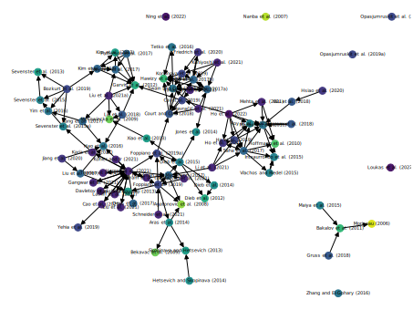
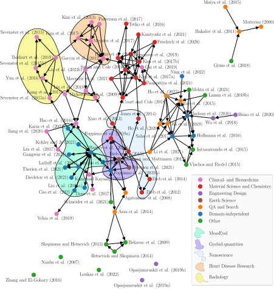

[](https://www.fz-juelich.de/iek/iek-3/DE/Home/home_node.html)

# Citation Graph Builder 🕸️
**A tool for the creation and visualization of citation networks** which combines citation data obtained from parsing the paper's PDF files and querying bibliographic APIs.
   


## Background
There are several online services which visualize citation networks. Some are more targeted towards literature search such as [Inciteful](https://inciteful.xyz/) and [Connected Papers](https://www.connectedpapers.com/), other such as [Citation Gecko](https://www.citationgecko.com/) allow for BibTeX upload and vector graphics (SVG) export. However, we found Citation Gecko to miss many references. A different approach is taken by the tool [ReviewVisualisation (ReViz)](https://github.com/l-hartung/reviz). Given a BibTeX file and the corresponding PDF files, ReViz leverages [GROBID](https://github.com/kermitt2/grobid) to parse the references within the PDFs. The citation network visualization of ReViz is very informative by mapping the nodes on a timeline depending on the publication years. However, this approach also misses many references and the visualization gets very messy with some more references. Therefore, we combine ReViz/GROBID with popular bibliographic APIs to create a more complete citation network. Currrently, the APIs of [OpenCitations](https://opencitations.net/querying) and [Semantic Scholar](https://www.semanticscholar.org/product/api) are queried.

## Installation
The latest Ubuntu is assumed. 

0. Clone this repository alongside its submodule
    ```bash
    git clone git@jugit.fz-juelich.de:iek-3/groups/data-and-model-integration/goepfert/citation-graph-builder.git    
    ```

1. You may want to adapt the maximum batch size in `./src/grobid_config.json` to suit your available RAM. GROBID requires around 3 GB of RAM for processing citations. In batch parallel processing, it is recommended to have 6 to 8 GB of RAM available ([source](https://grobid.readthedocs.io/en/latest/Grobid-docker/#out-of-memory-or-container-being-killed-while-processing)).

2. Create environment

    ```bash    
    conda env create -f requirements.yml
    conda activate citation_grapher_env
    ```

3. Install GROBID

    You can replace "0.7.1" by the latest version number. Check the latest version number [here](https://hub.docker.com/r/lfoppiano/grobid/tags).
    ```bash
    docker pull lfoppiano/grobid:0.7.1
    ```
    Note: Setting --consolidate_citations to true in version 0.7.0 results in a timeout (probably because of this [issue](https://github.com/kermitt2/grobid/issues/867)). If you use GROBID 0.7.0, set consolidate_citations to false within the code.

4. Install the GROBID Python client

    ```bash
    git clone https://github.com/kermitt2/grobid_client_python
    cd grobid_client_python
    python setup.py install
    ```

5. Install Graphviz

    ```bash
    sudo apt-get install graphviz graphviz-dev
    pip install pygraphviz
    ```

## Getting started
To create a citation network a BibTeX file is required. In order to extract references from the PDFs and bibliographic APIs, make sure that each article has a PDF and DOI or PMID associated before exporting the BibTeX file. The path to the PDF file should be specified with the BibTeX field `file` (e.g., `file = {path/to/pdf.pdf}`). We assume you used Zotero with BetterBibTeX with citation keys in the form of `lopezGROBIDCombiningAutomatic2009` to export the BibTeX file.

### Run the full pipeline
First, start the GROBID server (replace "0.7.1" with your version number)
    
```bash
docker run -t --rm --init -p 8070:8070 lfoppiano/grobid:0.7.1
```

Then use the <kbd>build_citation_graph</kbd> script with the argument `do_it_all` to execute the whole pipeline:
```bash
python src/build_citation_graph.py do_it_all --bibtex_file "example/input/literature.bib" --json_bib_file "example/output/prepared_library.json"
```

Depending on the number of papers, this process takes a while. If there are any doubts, you will be asked to resolve them via the console:
* If the the BibTeX record for a paper includes multiple files (e.g., a PDF for the paper and a PDF for supplementary material), you will be prompted to select which of those is the PDF of the paper.
* If the algorithm is unsure if a publication from the APIs and your BibTeX file match, you will be prompted to resolve the uncertainty.

When augmenting the references found by GROBID with data from the bibliographic APIs, you will be warned if there is a mismatch in publication years or titles between the metadata in your BibTeX file and the bibliographic APIs. A frequent reason for these discrepancies is that the APIs list an accepted manuscript on let's say ArXiV and your BibTeX file refers to the final published journal version and vice versa. 

In the end you get the results listed (and a nice graph):
```
 Found 146 references for the given set of articles of which:
    * 120 references have been verified ✔️ 
    * 18 references have been only identified by GROBID 🔍
    * 8 references have been only identified by bibliographic APIs 🤝
```

### Run individual steps
To run individual steps of the pipeline, use the <kbd>build_citation_graph</kbd> script with the following actions instead of `do_it_all`:
1. `prepare_bib`: Clean BibTeX and convert it to JSON.
2. `identify_refs`: Identify references in PDFs using GROBID.
3. `build_graph_model`: Build the graph and save it in a JSON file (based on [ReViz](https://github.com/l-hartung/reviz)).
4. `augment_refs`: Gather citations from bibliographic APIs.
5. `draw_graph`: Visualize the citation graph.


## Advanced options
### Draw the network with more options 
You can use the <kbd>draw_citation_graph</kbd> script to visualize an already build graph model with more options. 

* Plot the graph with Matplotlib and save as figure with `save_fig` and `fig_format`:
    ```bash
    python draw_citation_graph.py --save_fig --fig_format='svg'
    --graph_model_file 'graph/augmented_graph_model.json' --json_bib_file 'example/output/prepared_library.json' --fontsize 10 --nodesize 60 --use_latex --fig_width 6.3 --aspect_ratio 1.3
    ```
* Render the graph in your browser with `--render_in_browser`. 
* Export the graph definition and visualize the graph in an external tool (see "Render publication-ready visualization" below) using `--export` and `--export_format` 
    ```bash
    python draw_citation_graph.py --export --export_format 'graphml' --export_filename 'citation_graph' --graph_model_file 'graph/augmented_graph_model.json' --json_bib_file 'example/output/prepared_library.json'
    ```

### Categorical node colors
Per default the nodes in the citation graph are colored according to the publication year of the respective paper using the "--save_fig" option. You can color the nodes according to your own categorization by placing an .xlsx file in the main directory with the filename "paper_categories.xlsx". Within that file a sheet named "main" must have a column named "Paper" which contains the BibTeX keys of the given papers. Make sure the BibTeX keys are not sourounded by any whitespace. All other columns are treated as a categorization of the papers. For each categorization column an additional graph will be saved with node coloring according to the cell values in that column.

## Tips for rendering publication-ready visualizations
How do we define publication-ready? First, the figure should be a vector graphic and certainly not a pixelated bitmap. Second, you should be able to match the font family and size of the text within the figure and your publication (cf. [How to include an SVG image in LaTeX by JBC Engelen](http://tug.ctan.org/tex-archive/info/svg-inkscape/InkscapePDFLaTeX.pdf)). Lastly, you should be able to tweak the network manually.

### Tip 1 — Edit graph layout in yED
*Pyvis* is great to interact with a graph in your browser. However, it cannot export to any vector graphics file format like SVG. *Networkx* on the other hand allows to visualize graphs using Matplotlib which supports SVG export. However, with Networkx text is exported as paths (even with 'svg.fonttype' set to 'none'), which is why you cannot render the text directly in LaTeX (see next section). Above you cannot interact with the graph. Still you can tweak the graph in Inkscape, but if you move a node, the arrows do not move with it and so on making it very cumbersome. Therefore, we recommend to use the *yEd* graph editor. Unfortunately, "The Software may not be used as part of an automated process.", hence we use it manually and do not invoke it from the command line.
1. Open yED
1. Import the .graphml file
1. Since the graphml is very loosely standardized, labels will not be detected by yED. Re-add the labels by defining a mapping from the data field 'label' to 'Beschriftung' using 'Bearbeiten > Eigenschaften-Abbildungen' ('Edit > Properties Mapper').
1. Your nodes are probably still stacked on top of each other and not visualized as a nice network. To change that, click on 'Layout' and choose a graph layout algorithm (e.g., organic). Play around with different algorithms until you are happy with the result.
1. Now you can tweak the automatically generated layout by dragging the nodes to other positions.
1. With the property window on the bottom right you can tweak the appearance of the graph. Above, you can use the Properties Mapper to color the nodes depending on the publication year or another variable.
1. Export the graph as .svg file

### Tip 2 — Further edit the SVG with Inkscape
You can further edit the graph visualization in your favorite vector graphics editor. For example, to highlight clusters:



### Tip 3 — Let LaTeX render the texts in the figure itself
1. Convert the .svg file to a format which allows LaTeX to render the figure text itself by entering the folowing command `inkscape -D --export-latex --export-filename=citation_graph.pdf citation_graph.svg` in the command line. Alternatively, open the graph in Inkscape with GUI, save it as PDF and choose 'Omit text in pdf and create latex file' in the dialog box.
1. Move the .pdf and .pdf_tex file to your LaTeX document folder and import the figure in LaTeX:

    ```latex
    \begin{figure*}	
        \centering
        \fontsize{8pt}{10pt}\selectfont        
        \def\svgwidth{\textwidth}
        \input{assets/citation_graph.pdf_tex}
        \caption[Citation graph]{Citation graph of...}
        \label{fig:citation_graph}
    \end{figure*}
    ```


## Limitations
* Even though we combine the citation data obtained from parsing the PDFs and from bibliographic APIs, it might still happen that citations remain undetected.
* In your publication references to publication by the same author in the same year might be incremented by letters (e.g., "Lopez et al. (2009b)"). This tool does the same, but it may do so in a different order.

## License

MIT License

Copyright (c) 2021-2022 Jan Göpfert (FZJ/IEK-3), Patrick Kuckertz (FZJ/IEK-3), Jann Weinand (FZJ/IEK-3), Leander Kotzur (FZJ/IEK-3), Detlef Stolten (FZJ/IEK-3)

You should have received a copy of the MIT License along with this program.
If not, see https://opensource.org/licenses/MIT

Respect the licenses of [ReViz](https://github.com/l-hartung/reviz) (MIT License), [GROBID](https://github.com/kermitt2/grobid) (Apache-2.0) and the [Python client for GROBID Web services](https://github.com/kermitt2/grobid_client_python) (Apache-2.0) on which this work relies on.

## About Us

We are the [Institute of Energy and Climate Research - Techno-economic Systems Analysis (IEK-3)](https://www.fz-juelich.de/en/iek/iek-3) belonging to the [Forschungszentrum Jülich](https://www.fz-juelich.de/en). Our interdisciplinary department's research is focusing on energy-related process and systems analyses. Data searches and system simulations are used to determine energy and mass balances, as well as to evaluate performance, emissions and costs of energy systems. The results are used for performing comparative assessment studies between the various systems. Our current priorities include the development of energy strategies, in accordance with the German Federal Government’s greenhouse gas reduction targets, by designing new infrastructures for sustainable and secure energy supply chains and by conducting cost analysis studies for integrating new technologies into future energy market frameworks.

## Acknowledgements
The authors would like to thank the German Federal Government, the German state governments, and the Joint Science Conference (GWK) for their funding and support as part of the NFDI4Ing consortium. Funded by the German Research Foundation (DFG) – project number: 442146713. Furthermore, this work was supported by the Helmholtz Association under the program "Energy System Design".

<a href="https://nfdi4ing.de/"></a> <a href="https://www.helmholtz.de/en/"></a>
